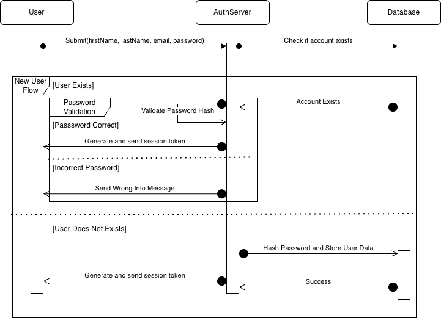
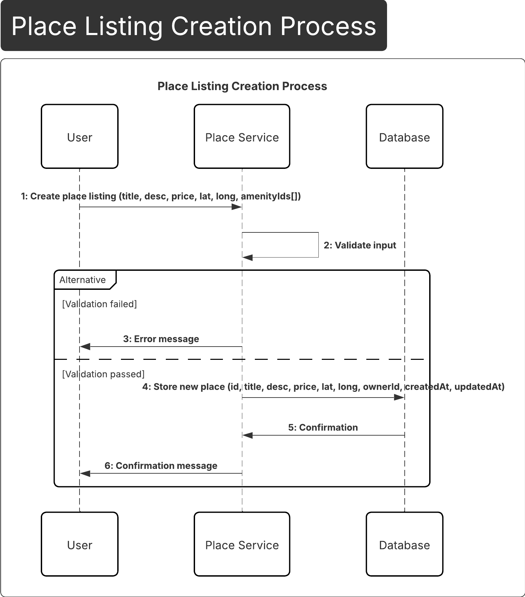

Part 1: Technical Documentation
Overview
This part focuses on designing and documenting the technical foundation of the HBnB Evolution application, a simplified Airbnb-like system. The goal is to provide a clear and structured blueprint of the system architecture, business logic, and component interactions before moving into implementation.
The documentation serves as a reference for understanding how different layers of the application collaborate to fulfill user requests while respecting the defined business rules and constraints.

Objectives
The primary objectives of this part are to:
Define the overall layered architecture of the application.
Model the core business entities and their relationships.
Illustrate the interaction flow between system layers for key API calls.
Ensure all designs accurately reflect the specified business rules and requirements.
Provide diagrams detailed enough to guide future implementation phases.

Application Scope
The HBnB Evolution application supports the following core functionalities:
User Management: User registration, profile updates, role identification (regular user or administrator).
Place Management: Creation, update, deletion, and listing of property listings owned by users.
Review Management: Submission and management of reviews for places, including ratings and comments.
Amenity Management: Management of amenities that can be associated with places.
All entities are uniquely identified and include audit information such as creation and update timestamps.

Architecture Overview
The application follows a three-layered architecture:
Presentation Layer
Handles user interactions through APIs and services. It receives requests, returns responses, and delegates processing to the business layer.
Business Logic Layer
Contains the core application logic and domain models (User, Place, Review, Amenity). This layer enforces business rules and coordinates data operations.
Persistence Layer
Responsible for data storage and retrieval. All entities are persisted in a database accessed through this layer.
Communication between layers is designed to follow clean separation of concerns and is illustrated using UML diagrams.

Deliverables
This part includes the following artifacts:
High-Level Package Diagram
Illustrates the layered architecture and communication between layers using the facade pattern.
Detailed Class Diagram (Business Logic Layer)
Models the main entities, their attributes, methods, and relationships, including associations between places and amenities.
Sequence Diagrams for API Calls
Four UML sequence diagrams demonstrating the flow of interactions for:
User Registration
Place Creation
Review Submission
Fetching a List of Places
Explanatory Notes
Brief descriptions accompanying each diagram to clarify purpose, flow, and design decisions.

Design Principles
UML notation is used consistently across all diagrams.
Clear separation between presentation, business, and persistence concerns.
Business rules and constraints are strictly reflected in the diagrams.
The documentation prioritizes clarity, readability, and implementation guidance.

Outcome
By completing Part 1, this repository provides a comprehensive technical blueprint of the HBnB Evolution application. This documentation lays a solid foundation for the implementation phases that follow, ensuring alignment between requirements, design, and development.
## Sequence Diagrams

### User Registration

### Place Creation

