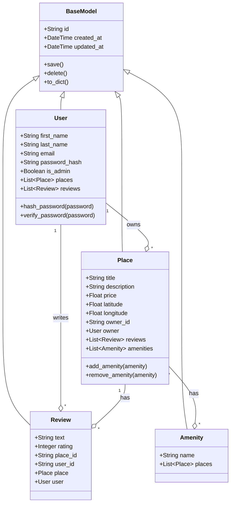

# HBnB Class Diagram

## Class Relationships with SQLAlchemy

## Relationship Details

### Inheritance
All entity classes inherit from `BaseModel`, which provides:
- UUID generation for `id`
- Automatic timestamps (`created_at`, `updated_at`)
- Common methods (`save()`, `delete()`, `to_dict()`)

### Association Types

| Relationship | Type | Implementation |
|--------------|------|----------------|
| User → Place | One-to-Many | `db.relationship()` with `backref='owner'` |
| User → Review | One-to-Many | `db.relationship()` with `backref='user'` |
| Place → Review | One-to-Many | `db.relationship()` with `backref='place'` |
| Place ↔ Amenity | Many-to-Many | Association table `place_amenity` |
