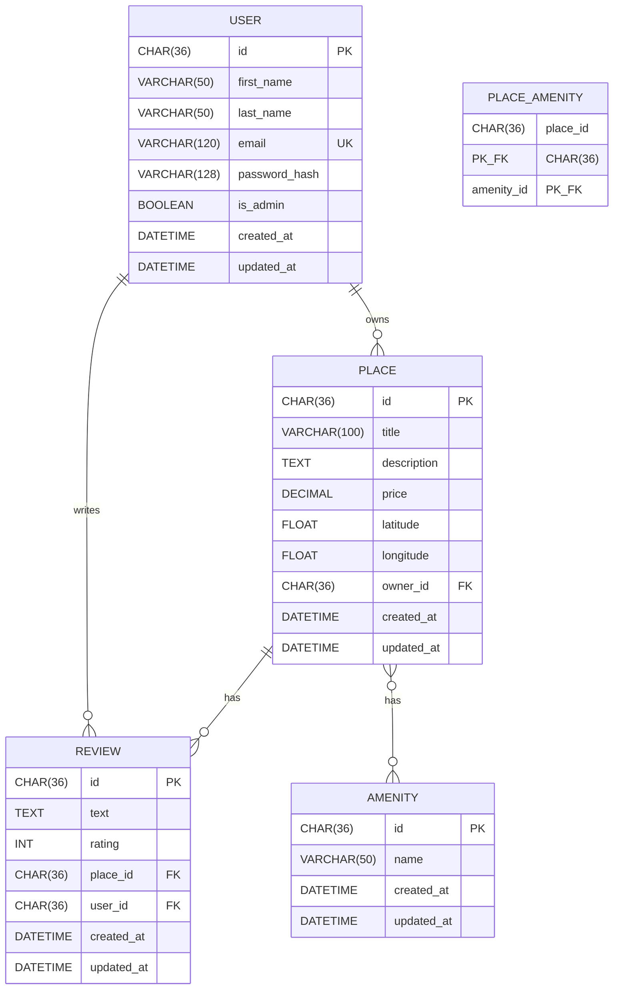

# HBnB Database Entity-Relationship Diagram

## Overview

This document contains the Entity-Relationship (ER) diagram for the HBnB application database schema. The diagram visualizes the relationships between all entities in the system.

## Entity-Relationship Diagram

## Relationships Description

### One-to-Many Relationships

| Parent | Child | Description |
|--------|-------|-------------|
| USER | PLACE | A user can own many places, but each place has exactly one owner |
| USER | REVIEW | A user can write many reviews, but each review is written by exactly one user |
| PLACE | REVIEW | A place can have many reviews, but each review belongs to exactly one place |

### Many-to-Many Relationships

| Entity 1 | Entity 2 | Junction Table | Description |
|----------|----------|----------------|-------------|
| PLACE | AMENITY | PLACE_AMENITY | A place can have many amenities, and an amenity can be associated with many places |

## Table Details

### USER Table
- **Primary Key**: `id` (UUID)
- **Unique Constraint**: `email`
- **Purpose**: Stores user account information including authentication credentials

### PLACE Table
- **Primary Key**: `id` (UUID)
- **Foreign Key**: `owner_id` references `USER(id)`
- **Cascade**: DELETE CASCADE (when user is deleted, their places are deleted)
- **Purpose**: Stores rental property listings

### REVIEW Table
- **Primary Key**: `id` (UUID)
- **Foreign Keys**: 
  - `place_id` references `PLACE(id)`
  - `user_id` references `USER(id)`
- **Unique Constraint**: (`place_id`, `user_id`) - One review per user per place
- **Check Constraint**: `rating` must be between 1 and 5
- **Cascade**: DELETE CASCADE on both foreign keys
- **Purpose**: Stores user reviews for places

### AMENITY Table
- **Primary Key**: `id` (UUID)
- **Purpose**: Stores available amenities (WiFi, Pool, etc.)

### PLACE_AMENITY Table (Junction/Association)
- **Composite Primary Key**: (`place_id`, `amenity_id`)
- **Foreign Keys**:
  - `place_id` references `PLACE(id)`
  - `amenity_id` references `AMENITY(id)`
- **Cascade**: DELETE CASCADE on both foreign keys
- **Purpose**: Associates places with their amenities (many-to-many)

## Cardinality Notation

| Symbol | Meaning |
|--------|---------|
| `\|\|` | Exactly one |
| `o{` | Zero or more |
| `}o` | Zero or more (reverse) |
| `\|{` | One or more |

## Business Rules Enforced by Schema

1. **Email Uniqueness**: Each user must have a unique email address
2. **One Review Per User Per Place**: A user can only leave one review for each place
3. **Rating Range**: Reviews must have a rating between 1 and 5
4. **Ownership**: Every place must have an owner (user)
5. **Referential Integrity**: 
   - Places are deleted when their owner is deleted
   - Reviews are deleted when their place or author is deleted
   - Place-Amenity associations are deleted when place or amenity is deleted
